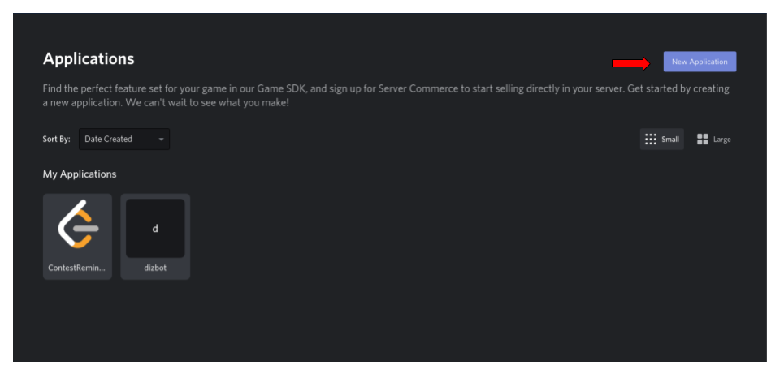
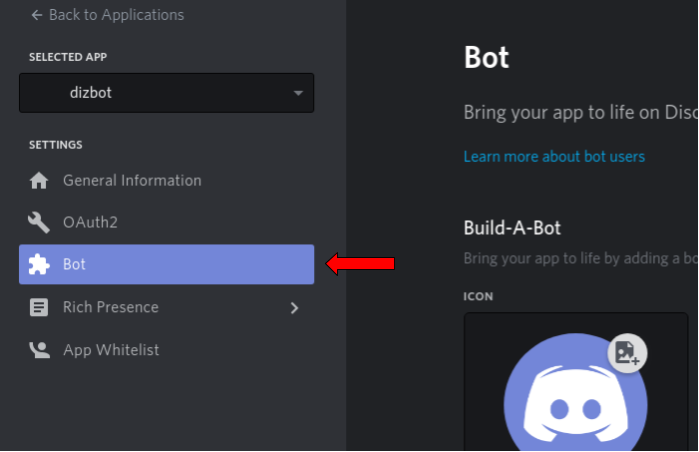
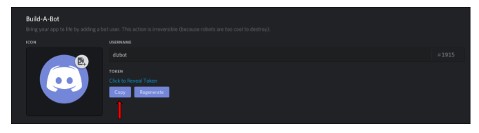
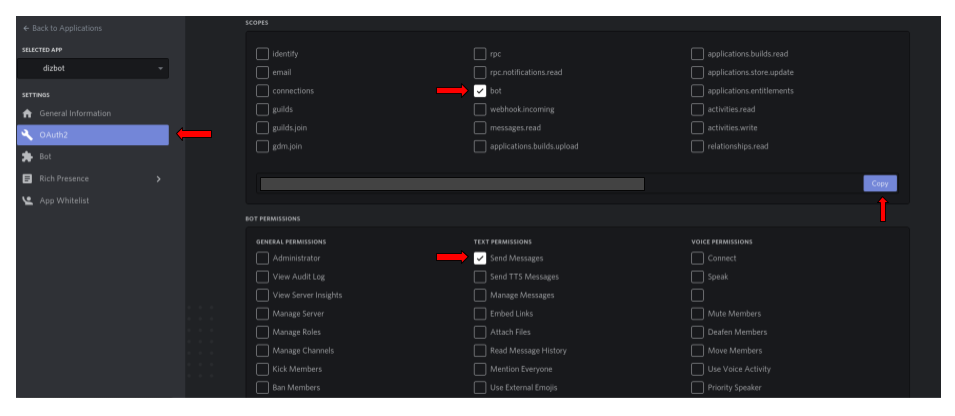
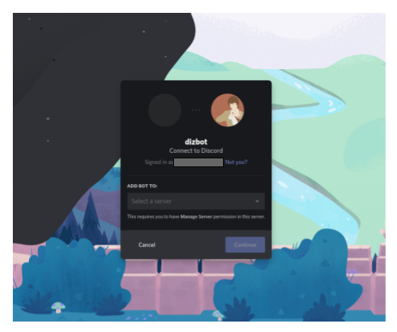

# Create your first bot using dizbot

## Machine setup

You can skip this section if you already have Python 3 and pip installed on your machine

### Python 3 and Pip

#### Python installation
1. [Open command prompt](https://www.isunshare.com/windows-10/4-ways-to-open-command-prompt-in-windows-10.html) if on windows or [open Terminal](https://support.apple.com/en-ca/guide/terminal/apd5265185d-f365-44cb-8b09-71a064a42125/mac) if on Mac or Linux, and run `python3 -v` to check if you already have Python. If it prints out the version, you are done
2. Otherwise [download and install](https://www.python.org/downloads/) the latest Python 3 version for your OS

#### Pip installation
1. Pip is usually installed with Python 3 >= 3.4. To verify, run command `pip -v`. If it prints out the version, you are done
2. Otherwise, you can download [get-pip.py](https://bootstrap.pypa.io/get-pip.py)
2. Open command prompt or terminal and navigate to the folder containing the `get-pip.py` file. Learn how to do it on [Windows](https://www.youtube.com/watch?v=sjaCgavMO18) and/or [Mac/Linux](https://www.youtube.com/watch?v=j6vKLJxAKfw)
3. Run the command: `python get-pip.py`
4. Confirm installation by running `pip -v`

## Discord setup

1. [Make a discord account](https://discord.onl/2019/01/24/how-to-create-a-discord-account/) if you haven't already
2. Go to [developer portal](https://discord.com/developers/applications) and click on the `New Application` button on the top right

3. Create the application and go to the `Bot` section and build a bot

4. Copy and securely save your bot's client token

5. Go to OAuth2 section, select the bot scope and add required permissions. Copy the generated URL and paste it into your browser (or send it to your server's admin)

6. Add the bot to a server you admin by following the instructions in this page

7. Congrats you have setup your new bot!