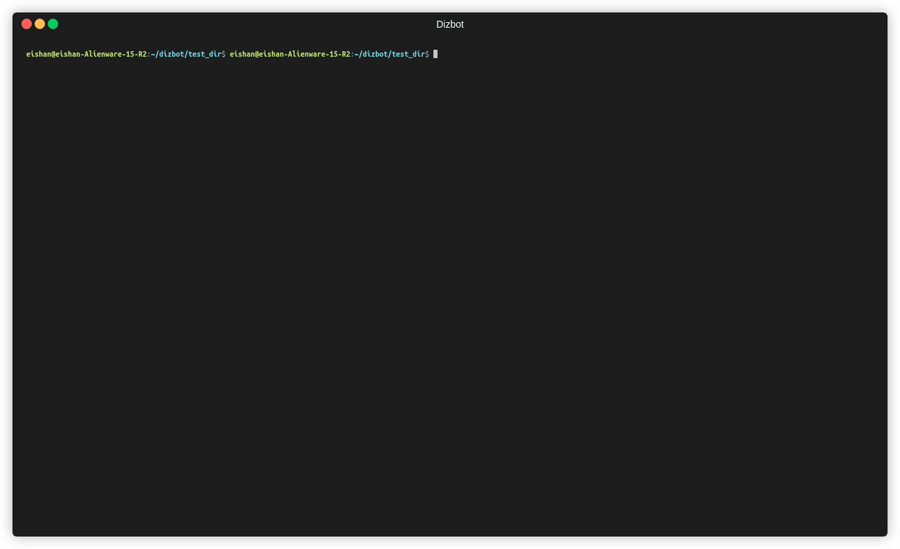

# dizbot

A command line tool to seemlessly build discord bots in python

## How to use

`dizbot create` command creates a python file `bot.py` which you can run using the command `python3 bot.py` to start your bot. dizbot saves the configuarations of your bot on file in the `dizbot-config.json` file, so please do not edit it. It creates a `client_token.txt` file which contains the client token. The `bot.py` code reads the client token from this file, so you can change it manually later. The command also appends the `dizbot-config.json` and `client_token.txt` file names to the `.gitignore` file if it exists. 

## How to install (temporary)
1. Clone this repo
2. Create a virtual python environment (optional but recommended)
3. Run `pip install --editable .`
