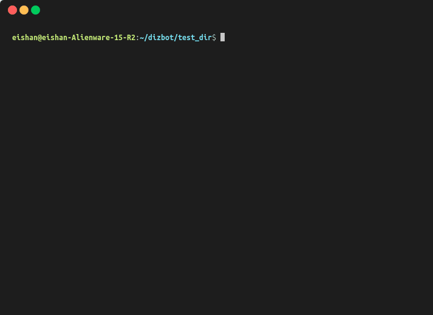

# dizbot

[](https://travis-ci.org/eishan05/dizbot)

A command line tool to seemlessly build discord bots in python

## How to install (temporary)
Run `pip install dizbot`

Note: Requires python version 3 or more

## How to use



1. Go into the directory you want to have the bot code in
2. Run command `dizbot run` and walk through the prompts to add commands and event handlers and create the bot
3. Add your bot's client token in the `client_token.txt` file if you didn't already add it through the CLI
4. Run `python3 bot.py` and test out your bot!

dizbot saves your bot's configurations into `dizbot_config.json` file and reads from it if you run `dizbot run` again

dizbot also appends `dizbot_config.json` and `client_token.txt` to your `.gitignore` to make sure that you do not accidently push sensitive info to github or other websites

After dizbot generates the python code, you can add more code to it!

The python file generated by the bot after going through the CLI shown in the demo gif:

```python
from discord.ext import commands

bot = commands.Bot(command_prefix='>')

@bot.command()
async def test(ctx, *args):
	await ctx.send('hi test!')

@bot.command()
async def ping(ctx, *args):
	await ctx.send('pong!')

@bot.event
async def on_member_join(member):
	channel = await member.create_dm()
	await channel.send('Hello new member!')

f = open('client_token.txt', 'r')
print('Running the bot...')
bot.run(f.read())
```
